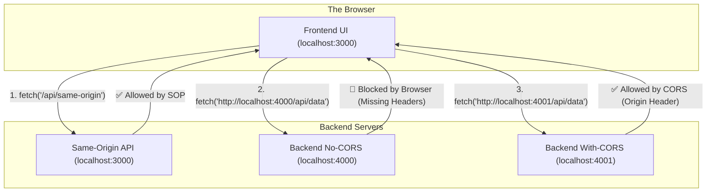
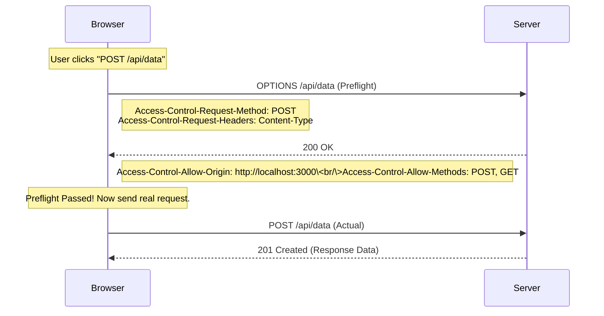

If you've ever built a modern web application, you've likely encountered the dreaded "CORS error" in your browser's console. It's the silent protector of the web, yet one of the most misunderstood security concepts for developers.

In this article, we’ll break down exactly how Cross-Origin Resource Sharing (CORS) works, why it exists, and how to handle it correctly using our [demoCORS](https://github.com/karankessy/demoCORS) project as a live reference.

---

## 🛡️ The Starting Point: Same-Origin Policy (SOP)

Before understanding CORS, we must understand the **Same-Origin Policy (SOP)**. SOP is a critical security mechanism that restricts how a document or script loaded from one origin can interact with a resource from another origin.

An **Origin** is defined as the combination of:

1. **Scheme** (e.g., `http` vs `https`)
2. **Host** (e.g., `localhost` vs `example.com`)
3. **Port** (e.g., `:3000` vs `:4000`)

Without SOP, a malicious website could easily read your private data from your bank's website if you had both open in the same browser.

---

## 🤝 What is CORS?

CORS is the "official" way to poke a hole in the Same-Origin Policy. It's a protocol that uses HTTP headers to tell the browser: _"It's okay for this specific frontend to access my resources."_

### The Core Architecture

In our [demoCORS](https://github.com/karankessy/demoCORS) project, we simulate a real-world scenario with three distinct origins running simultaneously:



---

## ⚡ Simple vs. Preflight Requests

The browser handles cross-origin requests in two different ways depending on what you're doing.

### 1. Simple Requests

These are "safe" requests that don't trigger a preflight. They must use `GET`, `HEAD`, or `POST` (with specific content types like `text/plain`).

### 2. Preflight Requests (The OPTIONS Check)

If you send a `POST` with a JSON body (`application/json`) or custom headers, the browser gets suspicious. It sends a "preflight" request using the `OPTIONS` method first to check if the server is okay with it.



---

## 📋 Essential CORS Headers Reference

| Header                             | Type     | Description                                                                      |
| :--------------------------------- | :------- | :------------------------------------------------------------------------------- |
| `Access-Control-Allow-Origin`      | Response | Which origins are allowed to access the resource.                                |
| `Access-Control-Allow-Methods`     | Response | List of allowed HTTP methods (GET, POST, etc.).                                  |
| `Access-Control-Allow-Headers`     | Response | List of allowed custom HTTP headers.                                             |
| `Access-Control-Allow-Credentials` | Response | Whether the browser should share the response when the credentials flag is true. |
| `Access-Control-Max-Age`           | Response | How long (in seconds) the preflight result can be cached.                        |
| `Origin`                           | Request  | The origin of the cross-origin request.                                          |

---

## 🛠️ Implementing CORS in Express.js

In our [server-with-cors.js](https://github.com/karankessy/demoCORS/blob/main/server-with-cors.js), we use the `cors` middleware to handle these headers correctly.

```javascript
const cors = require("cors");

app.use(
  cors({
    origin: "http://localhost:3000", // Only allow this specific origin
    methods: ["GET", "POST"],
    allowedHeaders: ["Content-Type", "Authorization"],
    credentials: true, // Allow cookies to be sent
    maxAge: 86400, // Cache preflight results for 24 hours
  })
);
```

---

## 🚩 Common Pitfalls & Security Considerations

1. **Using `*` with Credentials**: You cannot use `Access-Control-Allow-Origin: *` if you want to support cookies (`credentials: true`). You must specify a concrete origin.
2. **Missing Preflight Handling**: If you're not using a library like `cors`, you must manually handle the `OPTIONS` method and return a `200 OK` with the correct headers.
3. **CORS is NOT a Security Proxy**: Remember, CORS is enforced by the **browser**. It doesn't prevent a tool like `curl` or Postman from accessing your API. It only prevents a _browser script_ from reading the response.

---

## 🚀 Explore the Demo

To see this in action, clone the repository and run the servers:

```bash
git clone https://github.com/karankessy/demoCORS.git
cd demoCORS
npm install
npm start
```

Open `http://localhost:3000` and watch the **Network** tab in your DevTools to see the `OPTIONS` requests and CORS headers in real-time.

---

### Conclusion

CORS isn't just a bug to "fix"—it's a vital part of the web's security model. By understanding how the browser mediates these cross-origin handshakes, you can build more secure and robust web applications.

_Happy Hacking!_
